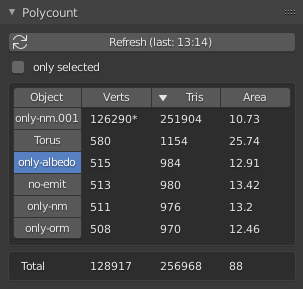

# Polycount

A Blender 2.8 addon helping to know about your scene polycount.

[Changelog](https://github.com/Vinc3r/Polycount/blob/master/changelog.md)
([*in development*](https://github.com/Vinc3r/Polycount/blob/master/changelog-dev.md))

1. [Installation](https://github.com/Vinc3r/Polycount#installation)
2. [Usage](https://github.com/Vinc3r/Polycount#usage)
3. [Known Limitations](https://github.com/Vinc3r/Polycount#known-limitations)

## Installation

1. download [last version](https://github.com/Vinc3r/Polycount/releases/latest)
2. in Blender go to *File* > *User Preferences* > *Add-ons* Tab
3. remove previous installation if needed (search *polycount* to easily find it)
4. install by using *Install from File...* in *Blender User Preferences* > *Add-ons* tab

Polycount is now available in `Properties` > `Scene` > `Polycount` tab.

## Usage

- `Refresh` button recompute calculation. It's not automatic due to performance reasons
- `only selected` checkbox allow toogle computation between all meshes in active View Layers or only mesh in current selection
- clicking on columns name toogle or change meshes sorting
- current active objet is visible in the Object column, and can be changed by clicking on a name
-  `*` char on Verts column tell you if if the mesh is out of the 16b mesh vertex buffer limit ([65 535](https://en.wikipedia.org/wiki/65,535#In_computing))
- `±` char on Tris column tell you if nGons are in the place

- Area is shown as m².

## Known Limitations

- Verts algorithm have to be enhanced (for now, a smoothed shading cube get the same count (8) as a sharped one, which should give us a count of 24). [need help](https://github.com/Vinc3r/Polycount/issues/2)
